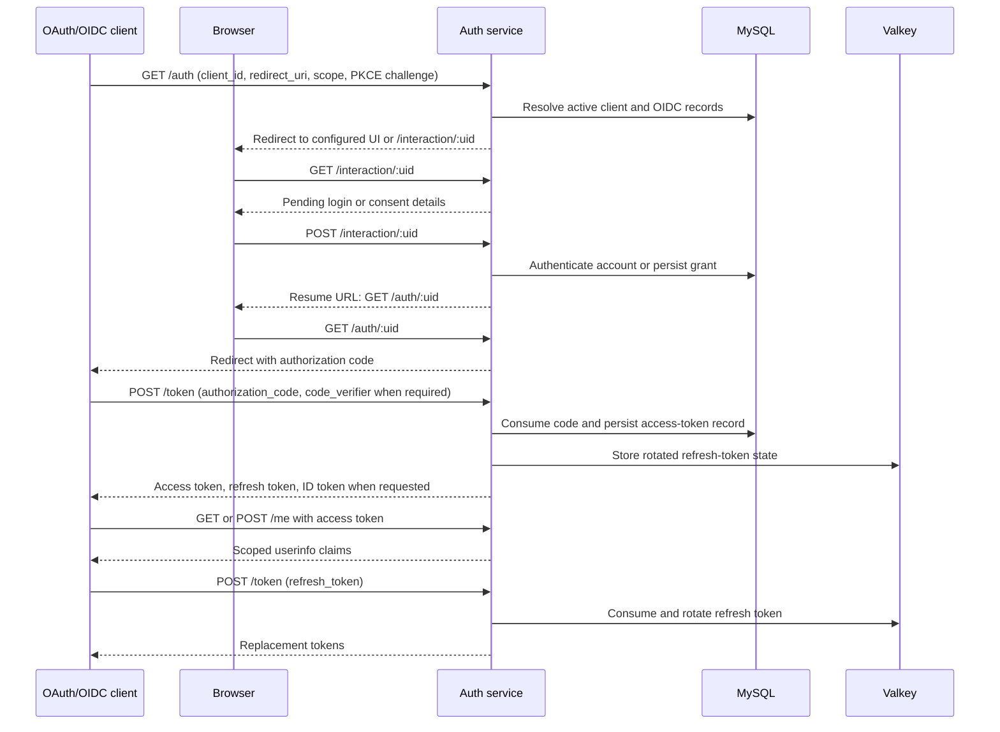
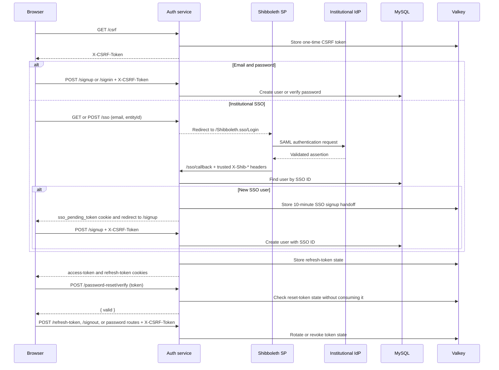

# DMP Tool Auth Service

The DMP Tool Auth Service provides email/password authentication, institutional SSO through a Shibboleth SP, and OAuth 2.0/OpenID Connect (OIDC) authorization-code flows. It persists users, signing keys, OAuth clients, and OIDC records in MySQL; Valkey holds short-lived CSRF, refresh-token, SSO-handoff, password-reset, and revocation state.

Browser authentication issues an RS256 access-token cookie and a refresh-token cookie. Their names default to `access_token` and `refresh_token` and can be changed with `ACCESS_TOKEN_NAME` and `REFRESH_TOKEN_NAME`.

## Run locally

```sh
cp .env.example .env
docker compose up --build
```

The Compose setup connects to the Apollo MySQL, Valkey, and LocalStack services on the external `dmptool-apollo-server_dmptool-network` network. It supplies `DB_HOST`, `DB_PORT`, `DB_DATABASE`, `CACHE_HOST`, `CACHE_PORT`, and `SSM_ENDPOINT`; configure the remaining values in `.env`.

The database credentials are not read from `MYSQL_URL` or `REDIS_URL`. At startup, the service reads `RdsUsername` and `RdsPassword` from AWS Systems Manager Parameter Store for `DEPLOYMENT_ENV`. The AWS credential provider chain must be able to read those parameters.

## Routes

All routes are rooted at `ISSUER`. Routes marked **CSRF** require a valid `X-CSRF-Token` header obtained from `GET /csrf`; consuming one returns a replacement token in the same header.

| Method | Route | Purpose |
| --- | --- | --- |
| `GET` | `/healthz` | Verifies that the service can reach Valkey and returns `{ "status": "ok" }`. |
| `GET` | `/csrf` | Creates a CSRF token, returns `ok`, and exposes it in `X-CSRF-Token`. |
| `POST` | `/csrf/verify` | Checks, without consuming, the supplied `X-CSRF-Token`; returns `{ "valid": boolean }`. |
| `POST` | `/signup` **CSRF** | Creates a `RESEARCHER` user from `email`, `password`, `givenName`, `surName`, optional `affiliationId`, `languageId`, and `acceptedTerms`; then sets browser auth cookies. An SSO handoff cookie can supply the SSO identity fields. |
| `POST` | `/signin` **CSRF** | Authenticates `email` and `password`, then sets browser auth cookies. |
| `POST` | `/refresh-token` **CSRF** | Consumes the refresh-token cookie and replaces both browser auth cookies. |
| `POST` | `/signout` **CSRF** | Revokes the current access and refresh tokens, then clears both browser auth cookies. |
| `POST` | `/password-reset/token` **CSRF** | Requires a valid access-token cookie and returns a one-time password-reset token. |
| `POST` | `/password-reset/verify` | Checks whether body field `token` is valid without consuming it; returns `{ "valid": boolean }`. |
| `POST` | `/password-reset` | Consumes `token`, `password`, and `passwordConfirmation` to reset a password. |
| `POST` | `/change-password` **CSRF** | Requires a valid access-token cookie; verifies `currentPassword` and applies `newPassword` and `newPasswordConfirmation`. |
| `GET` | `/revocations/:jti` | Reports whether an access-token JTI has been revoked. |
| `GET`, `POST` | `/sso`, `/sso/passthru` | Requires `email` and `entityId`; redirects the browser to the local Shibboleth SP login endpoint. |
| `GET`, `POST` | `/sso/callback`, `/sso/callback/:id` | Accepts only requests from the trusted Shibboleth proxy. Existing users receive browser auth cookies; new users receive a short-lived SSO handoff cookie and are redirected to `/signup`. |
| `GET` | `/interaction/:uid` | Returns the pending OIDC interaction's UID, prompt, client ID, and parameters. |
| `POST` | `/interaction/:uid` | Completes an OIDC `login` interaction with `email` and `password`, or completes the pending `consent` interaction. |
| `GET` | `/jwks.json` | Legacy redirect to `/.well-known/jwks.json`. |

`oidc-provider` handles the following routes after the application-specific routes above:

| Method | Route | Purpose |
| --- | --- | --- |
| `GET`, `OPTIONS` | `/.well-known/openid-configuration` | OIDC discovery metadata. |
| `GET`, `OPTIONS` | `/.well-known/oauth-authorization-server` | OAuth 2.0 authorization-server metadata. |
| `GET` | `/jwks` | Public JSON Web Key Set. |
| `GET` | `/auth` | Starts an authorization request. |
| `GET` | `/auth/:uid` | Resumes an authorization request after an interaction completes. |
| `POST` | `/token` | Exchanges an authorization code or refresh token. |
| `GET`, `POST` | `/me` | Returns OIDC userinfo for an access token with the appropriate scope. |

```mermaid
flowchart TB
    Browser[Browser or UI]
    Client[OAuth/OIDC client]
    Auth[DMP Tool Auth Service]
    SP[Shibboleth SP]
    IdP[Institutional IdP]
    MySQL[MySQL]
    Valkey[Valkey]

    Browser -->|GET /healthz, GET /csrf, POST /csrf/verify| Auth
    Browser -->|POST /signup, /signin, /refresh-token, /signout| Auth
    Browser -->|POST /password-reset/token, /password-reset, /change-password| Auth
    Browser -->|GET /revocations/:jti, GET /jwks.json| Auth
    Browser -->|GET or POST /sso, /sso/passthru| Auth
    Auth -->|/Shibboleth.sso/Login| SP
    SP <--> IdP
    SP -->|GET or POST /sso/callback[/:id]| Auth
    Client -->|discovery, GET /auth, POST /token, GET or POST /me, JWKS| Auth
    Browser -->|GET or POST /interaction/:uid| Auth
    Auth <--> MySQL
    Auth <--> Valkey
```

## OAuth and OIDC

Active OAuth clients are resolved from the `oauth_clients` and `oauth_client_redirect_uris` tables for every authorization and token request. `OIDC_CLIENTS_JSON` is a development/bootstrap fallback only when there are no active database registrations. Static client IDs take precedence, so do not duplicate static registrations in MySQL.

The provider supports the authorization-code and refresh-token grants configured for each client. PKCE is enforced when the client registration requires it. OIDC claims include `openid`, `profile`, `email`, and the service-specific `dmp` claims (`id`, `givenName`, `surName`, `role`, `affiliationId`, and `languageId`).



## Browser authentication and SSO

Public signup always assigns the `RESEARCHER` role; an administrator must promote users separately. Password reset tokens expire after `PASSWORD_RESET_TOKEN_TTL`.



## Environment variables

The service reads all configuration from environment variables and AWS SSM Parameter Store. Values marked **required** have no safe production default or are required by the selected feature. All durations are in seconds.

| Variable | Required | Default | Description |
| --- | --- | --- | --- |
| `NODE_ENV` | Production | `development` | Set to `production` for production behavior; production requires HTTPS issuer and secure cookies. |
| `PORT` | No | `3000` | HTTP listen port. |
| `ISSUER` | Production | `http://localhost:3000` | Public issuer URL, without a trailing slash. Must be HTTPS in production. |
| `DEPLOYMENT_ENV` | Deployment-specific | `DEV` | `@dmptool/utils` environment used to locate `RdsUsername` and `RdsPassword` in SSM. |
| `AWS_REGION` | No | `us-west-2` | AWS region used for Parameter Store. |
| `SSM_ENDPOINT` | Local only | none | Parameter Store endpoint override, such as LocalStack. Its presence disables TLS for the SSM connection. |
| AWS credentials | **Yes, unless an IAM role/profile supplies them** | none | Standard AWS credential-provider-chain input; for environment credentials use `AWS_ACCESS_KEY_ID`, `AWS_SECRET_ACCESS_KEY`, and, when applicable, `AWS_SESSION_TOKEN`. The principal must read the two required SSM parameters. |
| `DB_HOST` | No | `localhost` | MySQL host. |
| `DB_PORT` | No | `3306` | MySQL port. |
| `DB_DATABASE` | No | `dmp` | MySQL database name. |
| `CACHE_HOST` | No | `localhost` | Valkey host. |
| `CACHE_PORT` | No | `6379` | Valkey port. |
| `CACHE_CONNECT_TIMEOUT` | No | `30000` | Valkey connection timeout. |
| `CACHE_DISCONNECT_TIMEOUT` | No | `30000` | Valkey disconnect timeout. |
| `CACHE_KEEP_ALIVE` | No | `60000` | Valkey TCP keep-alive interval. |
| `LOG_LEVEL` | No | `INFO` | Logger level accepted by `@dmptool/utils`. |
| `COOKIE_SECURE` | **Yes in production** | `false` | Set exactly to `true` to mark cookies secure; required in production. |
| `ACCESS_TOKEN_NAME` | No | `access_token` | Access-token cookie name. |
| `REFRESH_TOKEN_NAME` | No | `refresh_token` | Refresh-token cookie name. |
| `SSO_PENDING_TOKEN_NAME` | No | `sso_pending_token` | Short-lived SSO signup-handoff cookie name. |
| `PEPPER_SECRET` | **Yes in production** | `default-pepper-secret` | Password-hash pepper. Set a unique secret outside local development. |
| `BCRYPT_SALT_ROUNDS` | No | `10` | BCrypt work factor for passwords. |
| `CSRF_TTL` | No | `3600` | CSRF token lifetime. |
| `UI_ACCESS_TOKEN_TTL` | No | `900` | Browser access-token lifetime. |
| `UI_REFRESH_TOKEN_TTL` | No | `604800` | Browser refresh-token lifetime. |
| `PASSWORD_RESET_TOKEN_TTL` | No | `7200` | Password-reset token lifetime. |
| `SHIBBOLETH_PROXY_SECRET` | **Yes when SSO is enabled** | none | Shared secret expected in `X-Shib-Proxy-Secret`. Without it, SSO callbacks return `403`. The proxy must remove externally supplied `X-Shib-*` and `X-Shib-Proxy-Secret` headers. |
| `OAUTH2_SIGN_IN_URL` | No | none | UI URL to which OIDC interactions are redirected with `uid`; without it, interactions use `/interaction/:uid`. |
| `OIDC_CLIENTS_JSON` | Bootstrap only | `[]` | Valid JSON array of static OAuth client objects. Used only if MySQL has no active client registrations. |
| `OIDC_CODE_TTL` | No | `120` | Authorization-code lifetime. |
| `OIDC_ACCESS_TOKEN_TTL` | No | `900` | OAuth/OIDC access-token lifetime. |
| `OIDC_REFRESH_TOKEN_TTL` | No | `3.154e+7` | OAuth/OIDC refresh-token and session lifetime (365 days). |
| `OIDC_GRANT_TTL` | No | `120` | OIDC grant lifetime. |
| `OIDC_ID_TOKEN_TTL` | No | `600` | OIDC ID-token lifetime. |
| `OIDC_INTERACTION_TTL` | No | `600` | OIDC interaction lifetime. |
| `DB_USERS_TABLE` | No | `users` | Users table name. |
| `DB_USER_EMAILS_TABLE` | No | `user_emails` | User email-address table name. |
| `DB_TEMPLATE_COLLABORATORS_TABLE` | No | `template_collaborators` | Template collaborator table name. |
| `DB_PROJECT_COLLABORATORS_TABLE` | No | `project_collaborators` | Project collaborator table name. |
| `DB_AUTH_KEYS_TABLE` | No | `auth_keys` | Persisted signing-key table name. |
| `DB_OAUTH_CLIENTS_TABLE` | No | `oauth_clients` | OAuth client-registration table name. |
| `DB_OAUTH_CLIENT_REDIRECT_URIS_TABLE` | No | `oauth_client_redirect_uris` | OAuth client redirect-URI table name. |
| `DB_OIDC_RECORDS_TABLE` | No | `oidc_records` | `oidc-provider` persistence table name. |

`RdsUsername` and `RdsPassword` are required SSM parameter names, not environment variables. The service exits if either cannot be read.

## OIDC record storage

`oidc_records` is the `oidc-provider` adapter's polymorphic persistence table. `model` identifies records such as `Grant`, `AuthorizationCode`, `AccessToken`, and `Session`; `(model, id)` is its primary key. The provider-owned `payload` JSON is model-specific. `grant_id`, `uid`, `user_code`, and `expires_at` support grant revocation, interaction/device lookups, and expiration. OIDC refresh-token records use the Valkey adapter for fast rotation.

## Tests

```sh
npm test
npm run build
npm run lint
```
